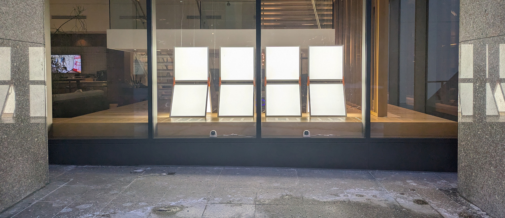

## [View Live Installation → www.thedropceiling.com](https://www.thedropceiling.com)

# Drop Ceiling
'Drop Ceiling' implements an open-source hardware and software system to transform ubiquitous office lighting into an interactive installation. It responds to the movement and position of people on the sidewalk using a Computer Vision system created from an array of standard security cameras. The installation showcases new methods of playful re-use via open data protocols.

Each lighting unit is constructed from three 2 ft × 2ft LED ceiling lights that are connected via 3D printed connectors. A custom hardware controller dynamically adjusts the brightness of each panel by interfacing with its standard 0 – 10V dimming protocol. All four of the units are networked together to allow them to uniformly respond to the position information from the Computer Vision system. The vision system utilizes the standard Real Time Streaming Protocol (RTSP) available in security cameras to create a custom tracking model that is focused on data privacy. Over time, the panels will develop an animated language to communicate with passers-by throughout the day and night.

---

## Table of Contents

1. [Protocols](#protocols)
   - [Input](#input)
   - [Output](#output)
2. [Software Guide](#software-guide)
   - [camera_calibration.py](#camera_calibrationpy)
   - [camera_tracker_osc.py](#camera_tracker_oscpy)
   - [lightController_osc.py](#lightcontroller_oscpy)
   - [Running the Applications](#running-the-applications)
   - [Troubleshooting](#troubleshooting)
3. [Operating Software](#operating-software)
   - [/IO](#io)
   - [/calibration](#calibration)
   - [/public-viewer](#public-viewer)
   - [/3dprintFiles](#3dprintfiles)
   - [/DMXtest](#dmxtest)
4. [License](#license)

---

## Protocols

### Input

#### RTSP Camera Feeds
The system uses standard PoE security cameras. While these are often designed to work with proprietary NVRs, many also have the ability to broadcast using the standard [Real Time Streaming Protocol (RTSP)](https://en.wikipedia.org/wiki/Real_Time_Streaming_Protocol). This open protocol can be read by most any programming language. Drop Ceiling uses 2 [Reolink RLC-520A](https://reolink.com/product/rlc-520a/) cameras. These were chosen for their good low-light performance, wide field of view, and decent framerate. Others have higher resolution, but this isn't useful for tracking.

#### Synthesis and Calibration
The feeds are processed first using [YOLOv11](https://docs.ultralytics.com/), a real-time object detection model optimized for identifying people in the frame. Each camera produces independent 2D detections with bounding boxes and confidence scores.

To translate these 2D pixel coordinates into a shared 3D world coordinate system, the installation uses [ArUco markers](https://docs.opencv.org/4.x/d5/dae/tutorial_aruco_detection.html)—square fiducial markers from the OpenCV library that encode unique IDs in their black and white patterns. Four markers are placed at known positions in the physical space, typically on the floor at measured distances. During calibration, each camera detects these markers and computes a homography matrix that maps its 2D image plane to the real-world ground plane.

Because the two cameras have overlapping fields of view, their detections must be reconciled. The system uses spatial proximity matching: when two cameras detect people in the same region, detections within a configurable distance threshold are merged into a single tracked individual. Each camera's contribution is weighted by detection confidence and viewing angle. The result is a unified coordinate stream with X/Z positions in centimeters, updated at approximately 15–20Hz depending on network conditions and processing load.

### Output

#### DMX over Art-Net
The brightness of each LED panel is sent in real-time as DMX data over the [Art-Net protocol](https://art-net.org.uk/). A standard DMX decoder receives the signals and a voltage divider circuit converts the 0–12V PWM signal into the standard 0–10V dimming protocol used by most LED ceiling panels.

---

## Software Guide

This section documents the three main Python applications used in the Drop Ceiling installation: **camera_calibration.py**, **camera_tracker_osc.py**, and **lightController_osc.py**.

---

### camera_calibration.py

#### Overview

Multi-camera YOLO person tracking and calibration tool. Uses NVIDIA GPU acceleration to detect and track people across multiple Reolink camera feeds. Provides ArUco marker-based calibration to map camera pixel coordinates to real-world floor positions.

**Primary Functions:**
- Connect to multiple RTSP camera streams
- Run YOLO person detection with CUDA acceleration
- Calibrate cameras using ArUco markers
- Visualize tracking across all cameras
- Generate synthesized top-down floor view

#### Hotkey Controls

| Key | Function |
|-----|----------|
| `1-9` | Show individual camera fullscreen (in normal mode) or select camera (in calibration mode) |
| `S` | Side-by-side view (all cameras horizontal) |
| `G` | Grid view (2×2, 3×3, etc.) |
| `T` | Synthesized top-down tracking view (requires calibration) |
| `C` | Enter calibration mode |
| `A` | Auto-calibrate all cameras (calibration mode only) |
| `SPACE` | Capture markers for active camera (calibration mode, manual) |
| `ENTER` | Compute 3D pose from captured markers (calibration mode) |
| `S` | Save calibration data (calibration mode only) |
| `ESC` | Exit calibration mode / Return to side-by-side |
| `Q` | Quit application |

#### View Modes

| Mode | Description |
|------|-------------|
| **INDIVIDUAL** | Single camera fullscreen with detection overlays |
| **SIDE_BY_SIDE** | All cameras displayed horizontally |
| **GRID** | Cameras arranged in 2×2 or 3×3 grid |
| **SYNTHESIZED** | Camera thumbnails on left, bird's-eye floor view on right |
| **CALIBRATION** | Camera thumbnails + calibration instruction panel |

#### On-Screen Data

**Status Bar (bottom):**
- Current view mode
- Total people detected
- Number of active cameras
- Current individual camera (if in individual mode)
- Available hotkeys reminder

**Per-Camera Overlays:**
- Camera name and FPS
- Detection bounding boxes (color-coded by track ID)
- Track ID labels (P1, P2, etc. for pedestrians)
- Confidence percentages

**Synthesized View:**
- Floor plan with tracking zones
- Person positions as colored dots
- Track ID labels
- Camera positions (when calibrated)

#### Configuration Files

| File | Purpose |
|------|---------|
| `camera_calibration.json` | Output calibration data (camera poses, marker positions) |

---

### camera_tracker_osc.py

#### Overview

Production camera tracker with OSC output. Tracks people using YOLO and sends their synthesized floor positions to the light controller via OSC messages. Designed for continuous 24/7 operation with robust error handling.

**Primary Functions:**
- Multi-camera person tracking
- Zone-based detection filtering (active/passive zones)
- Cross-camera track fusion
- OSC message output for real-time light control
- Configurable parameters via OpenCV sliders

#### OSC Messages Sent

| Address | Arguments | Description |
|---------|-----------|-------------|
| `/tracker/person/<id>` | `<x> <z>` | Position of each tracked person (in cm) |
| `/tracker/count` | `<n>` | Number of people currently tracked |
| `/tracker/zone/<id>` | `<zone>` | Zone of each person: `active`, `passive`, or `outside` |

#### Hotkey Controls

| Key | Function |
|-----|----------|
| `Q` | Quit application (graceful shutdown) |
| `S` | Save current settings to `tracker_settings.json` |

#### On-Screen Data

**Main Window ("Tracker OSC V2"):**
- Side-by-side camera views with detection overlays
- Person bounding boxes with track IDs
- Per-camera FPS display
- Zone-based coloring (active vs passive)

**Status Bar:**
- OSC target (`OSC_IP:OSC_PORT`)
- Active zone count
- Passive zone count
- Current frame number

**Settings Window:**
- OpenCV trackbars for real-time parameter adjustment
- Settings auto-save indicator

**Console Output (periodic health logs):**
- Uptime
- Frame count and average FPS
- Connected camera count
- OSC error count
- People tracked count
- Per-camera statistics

#### Slider Parameters

All parameters are adjustable via the **Settings** window:

| Slider | Range | Default | Description |
|--------|-------|---------|-------------|
| `confidence_threshold` | 10–80 | 40 | Minimum YOLO confidence (%) to accept a detection |
| `fusion_threshold_cm` | 50–300 | 150 | Max distance (cm) to fuse detections from multiple cameras |
| `fusion_threshold_far_cm` | 100–400 | 200 | Fusion threshold for distant detections |
| `track_match_threshold_cm` | 30–150 | 80 | Max distance (cm) to match detection to existing track |
| `position_smoothing` | 1–20 | 3 | Position filter strength (higher = smoother) |
| `velocity_smoothing` | 1–30 | 8 | Velocity filter strength |
| `max_track_age_frames` | 15–150 | 60 | Frames before a lost track is removed |
| `zone_filter_enabled` | 0–1 | 1 | Enable/disable zone-based filtering |
| `passive_zone_confidence` | 30–100 | 70 | Confidence threshold for passive zone detections |

#### Configuration Files

| File | Purpose |
|------|---------|
| `tracker_settings.json` | Persisted slider values (auto-saved) |
| `camera_calibration.json` | Camera poses (loaded from camera_calibration.py) |
| `world_coordinates.json` | Zone definitions, reference levels, floor bounds |

---

### lightController_osc.py

#### Overview

3D light controller with OpenGL visualization. Receives tracking data via OSC from the camera tracker and controls Art-Net DMX light output. Features an advanced behavior system with personality parameters, trend analysis, and multiple operating modes.

**Primary Functions:**
- 3D OpenGL visualization of light panels and tracking
- Receive OSC messages from camera tracker
- Run behavior system (wander, pulse, follow, dwell)
- Send Art-Net DMX to light fixtures
- Log tracking events to SQLite database
- Serve real-time data via WebSocket (for public viewer)
- Generate daily reports

#### Hotkey Controls

| Key | Function |
|-----|----------|
| `Arrow Keys` | Move light manually (when wander disabled) |
| `W` / `S` | Move light in Z axis (when wander disabled) |
| `SPACE` | Toggle wandering mode on/off |
| `P` | Cycle through personality presets |
| `L` | Toggle coordinate labels on 3D view |
| `M` | Toggle calibration markers display |
| `C` | Toggle camera view overlays |
| `F` | Toggle fullscreen mode |
| `HOME` | Reset camera to default view |
| `R` | Generate manual daily report (testing) |
| `D` | Cycle through available database files |
| `Q` / `ESC` | Quit application |

#### Mouse Controls (3D View)

| Action | Function |
|--------|----------|
| Left drag | Rotate camera view |
| Middle drag / Shift+Left drag | Pan camera |
| Scroll wheel | Zoom in/out |

#### On-Screen Data

**3D Visualization:**
- Light panel units with real positions/orientations
- Current light position (glowing sphere)
- Tracked people (spheres with labels)
- Active/passive zone boundaries
- Wander box boundaries
- Camera positions (optional)
- ArUco marker positions (optional)
- Origin sphere at (0,0,0)

**Slider Panel (right side):**
- Calibration sliders
- Personality sliders
- Global multiplier sliders
- Checkboxes for toggle settings

**Info Display (top-left, when labels enabled):**
- Current behavior mode
- Active/passive people counts
- Light position coordinates
- Current personality preset
- Wander state

**Console Output:**
- Hourly aggregation notifications
- Database pruning status
- Daily report summaries
- Personality changes
- Gesture detections

#### Slider Parameters

##### Calibration Sliders

| Slider | Range | Default | Description |
|--------|-------|---------|-------------|
| `offset_x` | -200 to 200 | 0 | X offset for tracker-to-light calibration (cm) |
| `offset_z` | 0 to 500 | 0 | Z offset for tracker-to-light calibration (cm) |
| `scale_x` | 0.5 to 2.0 | 1.0 | X scale factor |
| `scale_z` | 0.5 to 2.0 | 1.0 | Z scale factor |
| `invert_x` | ☐ checkbox | Off | Invert X axis |

##### Personality Sliders

| Slider | Range | Default | Description |
|--------|-------|---------|-------------|
| `responsiveness` | 0.0 to 1.0 | 0.5 | How quickly light reacts to people |
| `energy` | 0.0 to 1.0 | 0.5 | Overall activity level (affects pulse, speed) |
| `attention_span` | 0.0 to 1.0 | 0.5 | How long light dwells on a single person |
| `sociability` | 0.0 to 1.0 | 0.5 | Preference for crowded vs empty areas |
| `exploration` | 0.0 to 1.0 | 0.5 | Tendency to visit new areas |
| `memory` | 0.0 to 1.0 | 0.5 | How much past events influence behavior |

##### Global Multipliers

| Slider | Range | Default | Description |
|--------|-------|---------|-------------|
| `brightness_global` | 0.2 to 2.0 | 1.0 | Master brightness multiplier |
| `speed_global` | 0.2 to 2.0 | 1.0 | Master movement speed multiplier |
| `pulse_global` | 0.3 to 3.0 | 1.0 | Master pulse speed multiplier |
| `follow_speed_global` | 0.5 to 3.0 | 1.0 | How fast light follows people |
| `dwell_influence` | 0.0 to 2.0 | 1.0 | Influence of historical dwell data |
| `idle_trend_weight` | 0.0 to 2.0 | 1.0 | Weight of trend data in idle behavior |

#### Personality Presets

Cycle through presets with `P` key:

| Preset | Description |
|--------|-------------|
| **neutral** | Balanced default behavior |
| **reactive** | Quick response, short attention |
| **contemplative** | Slow, deliberate movements |
| **social** | Drawn to crowds |
| **explorer** | Prefers unexplored areas |
| **memory** | Strong influence from past events |

#### Configuration Files

| File | Purpose |
|------|---------|
| `slider_settings.json` | Persisted slider values |
| `world_coordinates.json` | Zone definitions, panel positions, bounds |
| `tracking_data.db` | SQLite database for tracking events and trends |

#### Database Architecture

The tracking database (`tracking_data.db`) uses SQLite for cross-platform compatibility. It automatically manages data lifecycle with tiered retention.

##### How Data is Populated

**1. Tracking Events (from camera_tracker_osc.py → lightController_osc.py)**

When a person is detected:
1. `camera_tracker_osc.py` sends OSC message: `/tracker/person/<id> <x> <z>`
2. `lightController_osc.py` receives this and calls `database.record_position(person_id, x, z)`
3. The database automatically:
   - Calculates velocity from previous position (if exists)
   - Determines zone (active/passive/unknown) based on coordinates
   - Calculates flow direction for passive zone (left-to-right, right-to-left, stationary)
   - Stores the event with timestamp

**2. Light Behavior (from lightController_osc.py)**

Every 0.5s (when active) or 2s (when idle):
- `record_light_state()` logs: position, target, brightness, pulse speed, mode, gesture type, people counts

**3. Aggregation (automatic in lightController_osc.py)**

- **Hourly**: At the start of each hour, `aggregate_hour()` summarizes the previous hour's raw events into `hourly_stats`
- **On Prune**: Before deleting old raw data, `prune_with_aggregation()` ensures all data is aggregated first

##### Database Tables

| Table | Purpose | Retention | Populated By |
|-------|---------|-----------|--------------|
| `tracking_events` | Raw person positions with velocity | 48 hours | `record_position()` on each OSC message |
| `light_behavior` | Light state snapshots | 48 hours | `record_light_state()` periodically |
| `person_sessions` | Individual visit durations | 48 hours | Session tracking logic |
| `hourly_stats` | Aggregated hourly statistics | Forever | `aggregate_hour()` at hour boundaries |
| `daily_stats_v2` | Aggregated daily statistics | Forever | `aggregate_day()` at midnight |
| `hourly_summary` | Legacy hourly summaries | — | Legacy (deprecated) |
| `daily_summary` | Legacy daily summaries | — | Legacy (deprecated) |

##### Data Fields in `tracking_events`

| Field | Type | Description |
|-------|------|-------------|
| `timestamp` | REAL | Unix timestamp |
| `datetime` | TEXT | ISO format datetime |
| `person_id` | INTEGER | Unique track ID from YOLO |
| `x`, `z` | REAL | Position in cm |
| `vx`, `vz` | REAL | Velocity in cm/s (auto-calculated) |
| `speed` | REAL | Total speed in cm/s |
| `zone` | TEXT | "active", "passive", or "unknown" |
| `flow_direction` | TEXT | "left_to_right", "right_to_left", or "stationary" |

##### Data Fields in `hourly_stats`

| Field | Type | Description |
|-------|------|-------------|
| `date` | TEXT | Date string (YYYY-MM-DD) |
| `hour` | INTEGER | Hour (0-23) |
| `total_events` | INTEGER | Raw event count |
| `unique_people` | INTEGER | Distinct person IDs |
| `active_count` | INTEGER | Active zone events |
| `passive_count` | INTEGER | Passive zone events |
| `avg_speed` | REAL | Average movement speed |
| `left_to_right` | INTEGER | Flow direction count |
| `right_to_left` | INTEGER | Flow direction count |
| `bloom_count` | INTEGER | Bloom gesture count |
| `dominant_mode` | TEXT | Most common behavior mode |
| `avg_brightness` | REAL | Average light brightness |

##### Retention & Pruning

The database uses **smart pruning** to balance performance with data preservation:

```
Raw Events (48 hours) → Hourly Stats (forever) → Daily Stats (forever)
```

- **Every hour**: Raw events from the completed hour are aggregated into `hourly_stats`
- **Every 6 hours**: `prune_with_aggregation()` runs to:
  1. Aggregate any un-aggregated hours
  2. Delete raw `tracking_events` older than 48 hours
  3. Delete raw `light_behavior` older than 48 hours
- **Result**: ~500MB/month raw data, permanent trend history

##### Batched Commits

For performance, the database uses batched commits:
- Commits after every **50 writes** OR every **1 second** (whichever comes first)
- Prevents disk I/O bottleneck during high-traffic periods
- Auto-commits on close to prevent data loss

---

### Running the Applications

#### Startup Order

1. **camera_calibration.py** — Run first if cameras need calibration
2. **camera_tracker_osc.py** — Start the tracker (sends OSC to light controller)
3. **lightController_osc.py** — Start the light controller (receives OSC, outputs Art-Net)

#### Typical Production Commands

```bash
# Terminal 1: Camera Tracker
cd /path/to/dc-dev/IO
python camera_tracker_osc.py

# Terminal 2: Light Controller
cd /path/to/dc-dev/IO
python lightController_osc.py
```

#### Network Ports

| Port | Protocol | Application | Direction |
|------|----------|-------------|-----------|
| 7000 | OSC/UDP | camera_tracker → lightController | Tracker sends |
| 6454 | Art-Net/UDP | lightController → Lights | Controller sends |
| 8765 | WebSocket | lightController → Public Viewer | Controller serves |

---

### Troubleshooting

#### Common Issues

| Symptom | Cause | Solution |
|---------|-------|----------|
| "Another camera tracker is already running" | Lock file exists | Kill existing process or delete `/tmp/camera_tracker_osc.lock` |
| No OSC messages received | Port mismatch or firewall | Check OSC_PORT settings match, verify UDP traffic |
| "No calibration loaded" | Missing calibration file | Run camera_calibration.py and complete calibration |
| Light not moving | Wander disabled | Press SPACE to enable wander mode |
| Art-Net not working | Library missing | Install `stupidArtnet`: `pip install stupidArtnet` |

---

## Operating Software
This repo contains all source code for Drop Ceiling. This includes: Calibration software and methods, Computer Vision tracking system, Lighting control software, and 3D printing files. 

### `/IO`
Core runtime software for the installation. The **Light Controller** (`lightController_osc.py`) serves as the central nervous system — receiving tracked positions via OSC, computing panel brightness using a virtual point light model, and outputting DMX values via Art-Net. It includes a sophisticated **Behavior System** (`light_behavior.py`) that transitions between personality modes (Idle, Engaged, Crowd, Flow) based on pedestrian activity, creating an animated language that evolves throughout the day. The **Camera Tracker** (`camera_tracker_osc.py`) performs real-time person detection from RTSP camera feeds using CUDA-accelerated YOLO inference, broadcasting positions via OSC. A **Tracking Database** (`tracking_database.py`) logs movement patterns for behavioral analysis, while a **Pedestrian Simulator** (`pedestrian_simulator.py`) enables testing without live camera feeds. Includes production utilities for 24/7 operation via systemd.

### `/calibration`
Tools and assets for calibrating the Computer Vision system. Contains ArUco marker images placed at known physical positions within the tracking zone, along with camera calibration data. The **Calibration Guide** documents the multi-camera setup process, including homography transforms that map pixel coordinates to real-world centimeters. Includes a CUDA-optimized tracker variant and the YOLO model weights used for person detection.

### `/public-viewer`
A Three.js web application that displays the real-time state of the installation via WebSocket. Renders the 12 LED panels as 3D boxes with dynamic brightness, visualizes tracked people as avatars, and shows the virtual point light with its falloff radius. Connects to the installation via Tailscale Funnel for secure public access. Features orbit controls for camera navigation and displays the current behavior mode and status text.

### `/3dprintFiles`
Design files for the physical panel connectors. Includes Fusion 360 source files for parametric editing, STL exports for slicing, and ready-to-print 3MF/GCode files. These 3D printed parts connect standard 2ft × 2ft LED ceiling panels into the angled three-panel units that comprise the installation.

### `/DMXtest`
Diagnostic utility for testing Art-Net communication with the DMX lighting controllers. The `artnetTest.py` script validates network connectivity and panel addressing before full system deployment.

## License

MIT License
