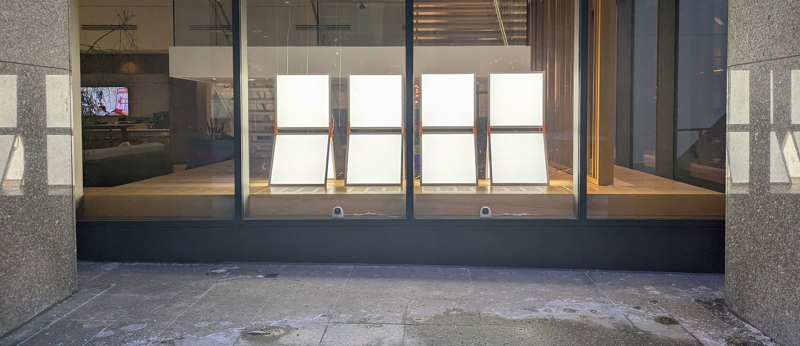
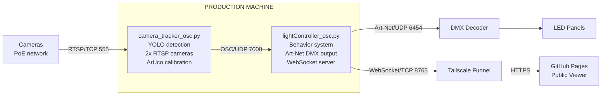

## [View Live Installation → thedropceiling.com](https://thedropceiling.com)

# Drop Ceiling

**Drop Ceiling** is an open-source interactive light installation that transforms standard office ceiling panels into a responsive, learning artwork. Four lighting units — each built from three 2 ft × 2 ft LED ceiling lights joined by 3D-printed connectors — hang in a street-level window. A pair of security cameras watch the sidewalk below, and a real-time computer vision system translates pedestrian movement into animated light behavior using only open data protocols.

The light has a personality. When no one is around it wanders gently, pulsing and drifting. When someone stops beneath the panels it locks on, brightens, and begins to breathe in rhythm with them. Over days and weeks an auto-tuning system adjusts the light's character to match the patterns of the site — learning when people are likely to stop, which attraction strategies work, and how energetic to be at different times of day.

No images of people are stored or transmitted. The vision system outputs only anonymous floor-plane coordinates.

---

## Documentation

| Document | Description |
|----------|-------------|
| **[How It Works](docs/HOW_IT_WORKS.md)** | Accessible overview of the installation — what visitors experience, the four behavior modes, and how the light learns over time |
| **[Behavior System](docs/BEHAVIOR_SYSTEM.md)** | Complete technical reference for modes, gestures, dwell phases, personality sliders, trend analysis, and feedback learning |
| **[Behavior Diagrams](docs/BEHAVIOR_DIAGRAMS.md)** | Visual architecture walkthrough — 8 Mermaid diagrams covering the full pipeline from camera to DMX |
| **[Software Guide](docs/SOFTWARE_GUIDE.md)** | Application reference — hotkeys, slider parameters, OSC messages, database schema, and configuration files |
| **[Hardware](docs/HARDWARE.md)** | Physical build details — panel units, wiring, DMX decoder, cameras, and network topology |
| **[Production Setup](docs/PRODUCTION_SETUP.md)** | Deployment guide — systemd services, Tailscale Funnel, monitoring, and maintenance |

### Additional Resources

| Resource | Description |
|----------|-------------|
| [Public Viewer README](public-viewer/README.md) | Three.js real-time 3D viewer — deployment, WebSocket protocol, Tailscale configuration |
| [Calibration Guide](calibration/CALIBRATION_GUIDE.md) | ArUco marker placement and multi-camera calibration process |

---

## Quick Start

```bash
# 1. Clone and set up
git clone https://github.com/your-username/Drop-Ceiling.git
cd Drop-Ceiling
python3 -m venv .venv && source .venv/bin/activate
pip install torch ultralytics opencv-python-headless python-osc pygame PyOpenGL stupidArtnet websockets numpy

# 2. Calibrate cameras (one-time, on-site)
cd calibration
python camera_calibration.py    # Press C → A for auto-calibration

# 3. Run the system (two terminals)
cd IO
python camera_tracker_osc.py    # Terminal 1: tracks people, sends OSC
python lightController_osc.py   # Terminal 2: receives OSC, outputs Art-Net + WebSocket
```

See [Production Setup](docs/PRODUCTION_SETUP.md) for 24/7 deployment with systemd.

---

## Architecture


```mermaid
flowchart LR
       subgraph PROD["PRODUCTION MACHINE"]
              TRACKER["camera_tracker_osc.py<br/>YOLO detection<br/>2x RTSP cameras<br/>ArUco calibration"]
              CONTROLLER["lightController_osc.py<br/>Behavior system<br/>Art-Net DMX output<br/>WebSocket server"]
       end

       CAMERAS["Cameras<br/>PoE network"] -->|"RTSP/TCP 555"| TRACKER
       TRACKER -->|"OSC/UDP 7000"| CONTROLLER
       CONTROLLER -->|"Art-Net/UDP 6454"| DMX["DMX Decoder"]
       DMX --> LEDS["LED Panels"]
       CONTROLLER -->|"WebSocket/TCP 8765"| FUNNEL["Tailscale Funnel"]
       FUNNEL -->|"HTTPS"| VIEWER["GitHub Pages<br/>Public Viewer"]
```

### Network Ports

| Port | Protocol | Direction | Purpose |
|------|----------|-----------|---------|
| 7000 | OSC/UDP | Tracker → Controller | Person positions (x, z) at 25 Hz |
| 6454 | Art-Net/UDP | Controller → DMX Decoder | 12 panel brightness values at 30 FPS |
| 8765 | WebSocket/TCP | Controller → Public Viewer | JSON state updates at ~15 FPS |
| 555 | RTSP/TCP | Cameras → Tracker | H.264 video streams |

### Protocols

**Input — RTSP Camera Feeds**: The system uses standard PoE security cameras broadcasting via [RTSP](https://en.wikipedia.org/wiki/Real_Time_Streaming_Protocol). Drop Ceiling uses two [Reolink RLC-520A](https://reolink.com/product/rlc-520a/) cameras chosen for low-light performance and wide field of view. Feeds are processed with [YOLO v11](https://docs.ultralytics.com/) for person detection. [ArUco markers](https://docs.opencv.org/4.x/d5/dae/tutorial_aruco_detection.html) placed at known floor positions provide the calibration transform from pixel coordinates to real-world centimeters. Cross-camera fusion merges overlapping detections into a unified coordinate stream at ~15–20 Hz.

**Output — DMX over Art-Net**: Panel brightness values are sent as [Art-Net](https://art-net.org.uk/) DMX data. A standard DMX decoder receives the signals and a voltage divider circuit converts the 0–12V PWM output to the 0–10V dimming protocol used by LED ceiling panels.

---

## Repository Structure

| Directory | Contents |
|-----------|----------|
| [`IO/`](IO/) | Core runtime — light controller, camera tracker, behavior system, tracking database, pedestrian simulator, systemd services |
| [`calibration/`](calibration/) | ArUco marker images, calibration guide, camera calibration data, CUDA-optimized tracker variant |
| [`public-viewer/`](public-viewer/) | Three.js web app — real-time 3D visualization of panels, light, and tracked people via WebSocket |
| [`3dprintFiles/`](3dprintFiles/) | Panel connector designs — Fusion 360 source, STL exports, ready-to-print 3MF/GCode |
| [`DMXtest/`](DMXtest/) | Art-Net diagnostic utility for validating panel addressing |
| [`docs/`](docs/) | Project documentation — behavior reference, diagrams, software guide, hardware, deployment |

---

## License

MIT License
