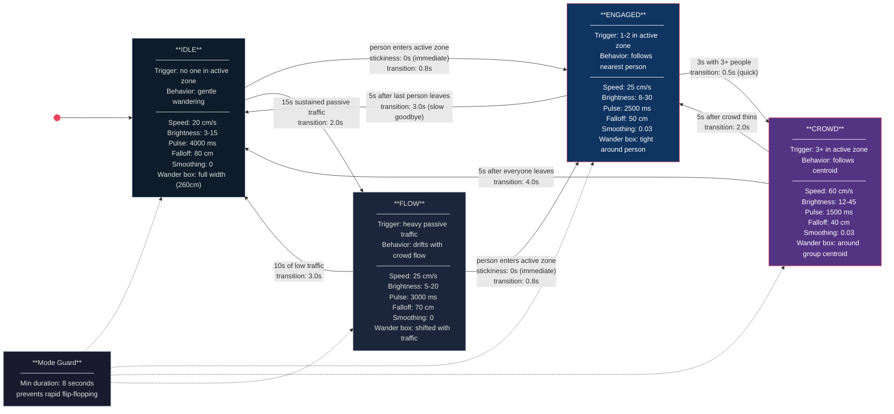
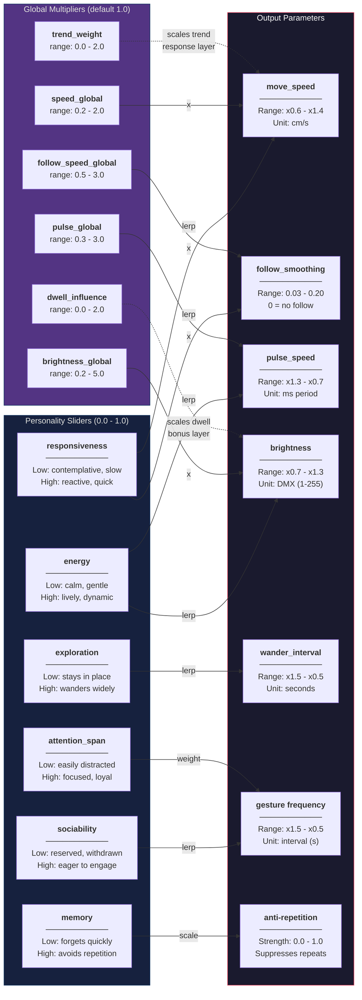
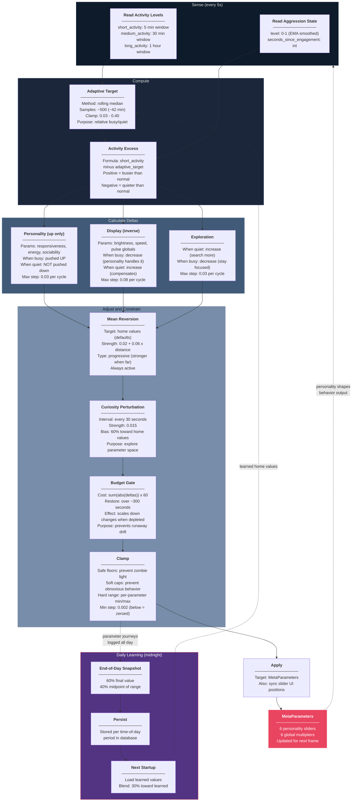
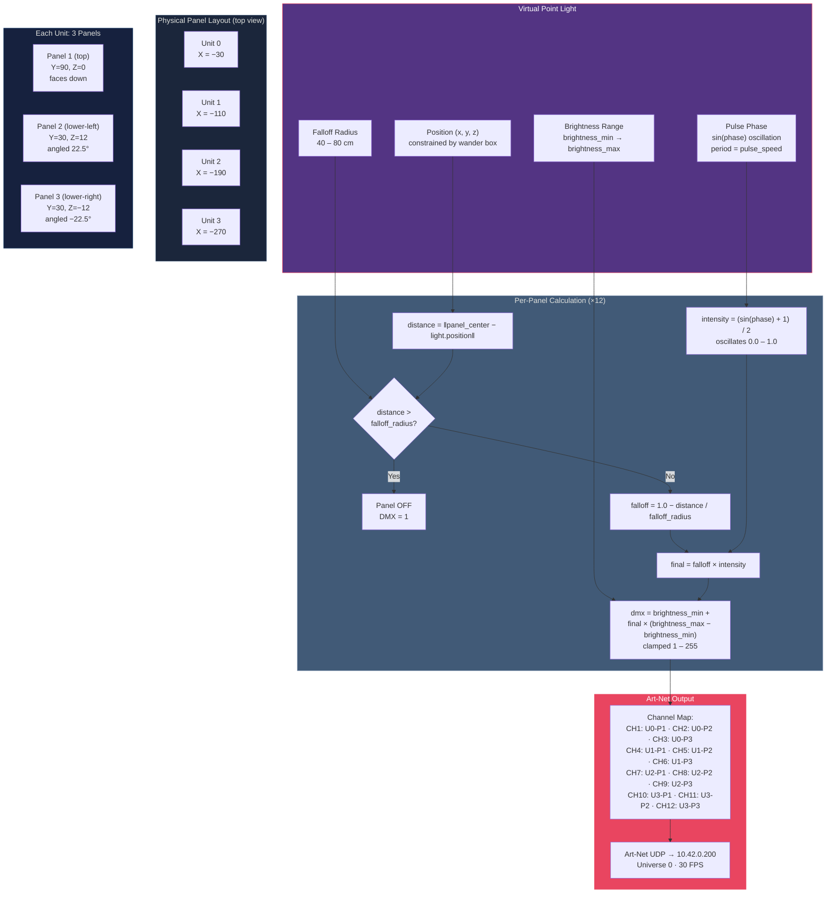
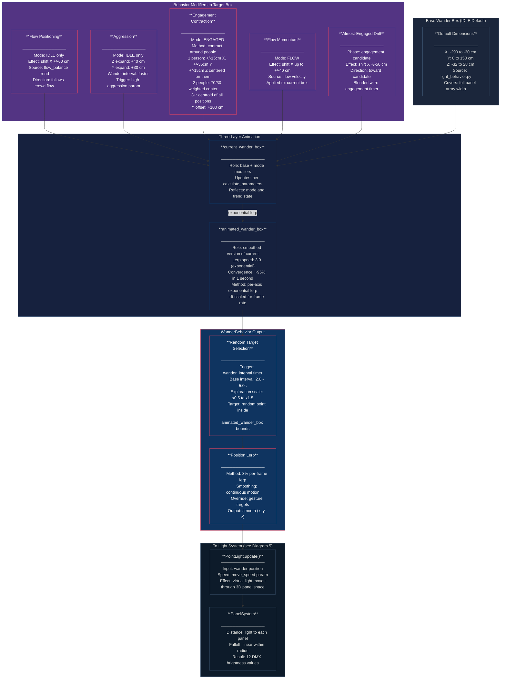
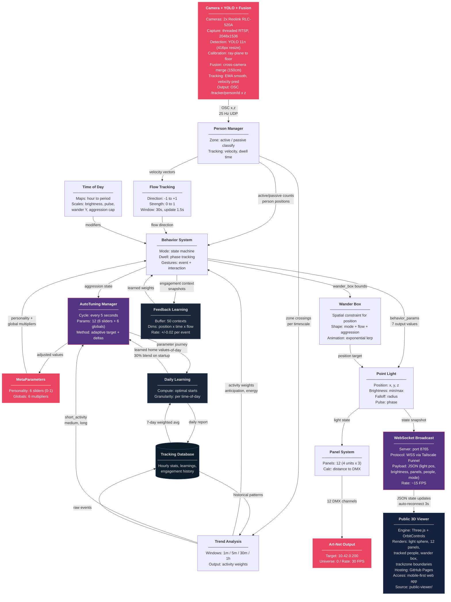

# Drop Ceiling — Behavior System Diagrams

A visual walkthrough of how the Drop Ceiling light thinks, moves, and learns — from camera input to physical light output.

Each diagram builds on the previous one. If you're new to the project, read them in order. If a section feels abstract, use the **Wander Box** diagram as the anchor: it connects behavior decisions to spatial motion and ultimately to DMX output.

> All diagrams use [Mermaid](https://mermaid.js.org/) syntax and render natively on GitHub.

---

## 1. System Overview

The Drop Ceiling installation is a single simulated point light that moves above a grid of LED panels. Two cameras watch pedestrians below, and the light responds in real-time.

Data flows through six stages: two RTSP cameras capture video, YOLO detects people, calibration projects detections to real-world floor coordinates, cross-camera fusion and temporal tracking produce stable positions, the behavior system decides what the light should do, and Art-Net sends DMX values to the physical panels.

```mermaid
flowchart LR
    subgraph INPUT["Camera Input"]
        direction TB
        CAM1["<b>Camera 1 (Right)</b>
        ───────────────
        Model: Reolink RLC-520A
        Position: X=-30, Z=78
        IP: 10.42.0.75
        RTSP port 555
        Resolution: 2048 x 1536"]

        CAM2["<b>Camera 2 (Left)</b>
        ───────────────
        Model: Reolink RLC-520A
        Position: X=-270, Z=78
        IP: 10.42.0.172
        RTSP port 555
        Resolution: 2048 x 1536"]
    end

    subgraph DETECT["Detection and Calibration"]
        direction TB
        ROBUST["<b>RobustCamera</b>
        ───────────────
        Threads: 1 daemon per camera
        Buffer flush: grab() x3
        Reconnect: auto on failure"]

        YOLO["<b>YOLO 11n</b>
        ───────────────
        Input: 416px resize
        Class: person only
        Confidence: 0.10 - 0.80
        Output: bounding boxes"]

        CAL["<b>Calibration</b>
        ───────────────
        Method: ray-plane intersect
        Floor: Y = -66 cm
        Pre-computed: R_T, K_inv
        Output: world (X, Z) cm"]

        ROBUST --> YOLO --> CAL
    end

    subgraph TRACKING["Fusion and Tracking"]
        direction TB
        FUSE["<b>Cross-Camera Fusion</b>
        ───────────────
        Merge: different cameras only
        Threshold: 50 - 300 cm
        Method: greedy nearest-neighbor"]

        SMOOTH["<b>Temporal Tracking</b>
        ───────────────
        Velocity: prediction + correct
        EMA alpha: 0.01 - 0.20
        Prune: 60 frames lost"]

        FUSE --> SMOOTH
    end

    subgraph TRANSPORT["OSC Transport"]
        OSC["<b>OSC Output</b>
        ───────────────
        /tracker/count n
        /tracker/person/id x z
        Target: 127.0.0.1:7000
        Protocol: UDP, 25 Hz"]
    end

    subgraph BRAIN["Behavior Engine"]
        direction TB
        TRACK["<b>Person Manager</b>
        ───────────────
        Zone: active / passive classify
        Velocity: per-person tracking
        Dwell: time in zone
        Callbacks: enter / exit / move"]
        BEH["<b>Behavior System</b>
        ───────────────
        Mode: IDLE / ENGAGED / CROWD / FLOW
        Gestures: 16 types, phase-gated
        Personality: 6 meta sliders
        Learning: feedback + daily"]
        TRACK --> BEH
    end

    subgraph CONTROLLER["Light Controller"]
        direction TB
        LIGHT["<b>Point Light</b>
        ───────────────
        Position: x, y, z (cm)
        Constrained by: wander box
        Brightness: min / max range
        Falloff: radius (cm)
        Pulse: sine wave phase"]
        PANELS["<b>Panel System</b>
        ───────────────
        Layout: 4 units x 3 panels
        Calc: distance-based falloff
        Output: 12 DMX values (1-255)"]
        LIGHT --> PANELS
    end

    subgraph OUTPUT["Physical Output"]
        ARTNET["<b>Art-Net</b>
        ───────────────
        Protocol: Art-Net UDP
        Channels: 12 (Universe 0)
        Target: 10.42.0.200
        Rate: 30 FPS"]
        LEDS["<b>LED Panels</b>
        ───────────────
        Units: 4 ceiling-mounted
        Panels per unit: 3
        Control: single DMX ch each"]
        ARTNET --> LEDS
    end

    CAM1 --> ROBUST
    CAM2 --> ROBUST
    CAL -->|"world detections"| FUSE
    SMOOTH -->|"tracked (id, x, z)"| OSC
    OSC -->|"x, z per person"| TRACK
    BEH -->|"behavior_params dict
    brightness, speed, falloff,
    pulse, smoothing, wander_box"| LIGHT
    PANELS -->|"12 DMX values
    (1-255 per panel)"| ARTNET

    style INPUT fill:#1a1a2e,stroke:#e94560,color:#fff
    style DETECT fill:#16213e,stroke:#0f3460,color:#e0e1dd
    style TRACKING fill:#0f3460,stroke:#e94560,color:#fff
    style TRANSPORT fill:#1a1a2e,stroke:#0f3460,color:#fff
    style BRAIN fill:#1a1a2e,stroke:#16213e,color:#fff
    style CONTROLLER fill:#1a1a2e,stroke:#533483,color:#fff
    style OUTPUT fill:#1a1a2e,stroke:#e94560,color:#fff
```

Three Python files implement the system:

| File | Responsibility |
|---|---|
| `camera_tracker_osc.py` | Camera capture, YOLO detection, calibration, fusion, temporal tracking, OSC output |
| `light_behavior.py` | State machine, gestures, trend analysis, feedback learning |
| `lightController_osc.py` | Main loop, OSC input, point light, panel math, Art-Net output, auto-tuning |

---

## 2. Behavior Mode State Machine

The light is always in one of four modes. Mode determines the base personality — how fast it moves, how bright it shines, and whether it follows someone or wanders on its own.

Transitions are **not instantaneous**. Conditions must persist for a minimum duration (stickiness) before the mode switches, and parameters interpolate smoothly over a transition period.

**Key design choice**: Engaging is fast (0.5–0.8s), disengaging is slow (2.0–4.0s). The light is eager to connect and reluctant to let go.

---

## 3. MetaParameters → Actual Light Values

The personality system consists of **6 sliders** (0.0–1.0) that define the light's character and **6 global multipliers** that scale the output. Together they transform the mode base values into the light's actual behavior.

**Example**: With `responsiveness = 0.8` and `speed_global = 1.2`:
- Base mode speed is 20 cm/s (IDLE)
- Responsiveness maps to ×1.24 (lerp between 0.6 and 1.4 at 0.8)
- Global multiplier applies: 20 × 1.24 × 1.2 = **29.8 cm/s**

---

## 4. AutoTuning Feedback Loop

The `AutoTuningManager` runs every 5 seconds and continuously adjusts the personality parameters based on observed activity. The key insight is **asymmetric adjustment**: personality sliders are only pushed *up* when activity is high — they're never pushed down. Only mean reversion gently brings them back toward home values.

**Tuned parameters and their constraints:**

| Parameter | Min | Max | Safe Floor | Soft Cap | Home |
|---|---|---|---|---|---|
| responsiveness | 0.0 | 1.0 | 0.30 | 0.90 | 0.50 |
| energy | 0.0 | 1.0 | 0.25 | 0.85 | 0.45 |
| attention_span | 0.0 | 1.0 | 0.10 | — | 0.50 |
| sociability | 0.0 | 1.0 | 0.20 | — | 0.45 |
| exploration | 0.0 | 1.0 | 0.15 | — | 0.40 |
| memory | 0.0 | 1.0 | — | — | 0.30 |
| brightness_global | 0.2 | 5.0 | 0.60 | 3.0 | 1.20 |
| speed_global | 0.2 | 2.0 | 0.35 | 1.6 | 0.70 |
| pulse_global | 0.3 | 3.0 | 0.35 | 2.0 | 0.80 |
| follow_speed_global | 0.5 | 3.0 | 0.60 | — | 1.00 |
| dwell_influence | 0.0 | 2.0 | — | — | 0.50 |
| idle_trend_weight | 0.0 | 2.0 | 0.10 | — | 0.40 |

---

## 5. Light Position → Panel DMX Output

The final stage converts the virtual point light into 12 physical DMX values. The `PanelSystem` models the exact physical layout: 4 lighting units at different X positions, each containing 3 LED panels at different angles.

**The brightness equation in plain language:**

1. Measure the distance from the light to each panel's center point
2. If the panel is outside the falloff radius, it's off (DMX = 1)
3. Otherwise, compute a falloff factor: closer panels are brighter (linear decay)
4. Multiply the falloff by the current pulse intensity (a sine wave that breathes between 0 and 1)
5. Map the result into the brightness range and convert to a DMX byte (1–255)

---

## 6. Wander Box: Behavior Inputs to Spatial Motion

The wander box is a 3D bounding volume that constrains where the virtual point light can move. Every behavior modifier — flow direction, aggression, engagement contraction — works by reshaping this box, not by steering the light directly.

The box uses a three-layer animation system: `current_wander_box` reflects the raw mode and modifier state, `animated_wander_box` smooths that with an exponential lerp (~95% converged in one second), and `WanderBehavior` picks random points inside the animated box at timed intervals.

### Worked Example: IDLE vs ENGAGED

| Stage | IDLE (no active person) | ENGAGED (1 active person) |
|---|---|---|
| Mode baseline | `move_speed=20`, `wander_interval=5.0`, `falloff=80` | `move_speed=25`, `wander_interval=4.0`, `falloff=50`, `follow_smoothing=0.03` |
| Wander box behavior | Uses broader base box, chooses exploratory targets | Contracts and anchors around person; target updates stay close |
| Position path | Slower, wider drift across full panel span | Tighter, more deliberate tracking near person position |
| DMX result | Wider illumination spread, gentler panel transitions | More localized hotspots, stronger panel contrast, faster local changes |

### Mini Scenario: Passive Flow Shifts Panel Emphasis (10–20s)

A common street condition: people move through the passive zone mostly left-to-right while nobody is actively engaged. The behavior system treats that as directional flow pressure and shifts wander preference toward the incoming side.

```mermaid
flowchart LR
    T0["t=0s<br/>No active person<br/>Mode: IDLE or FLOW candidate"] --> T1["t=0..10s<br/>Passive detections accumulate<br/>flow tracker updates (~1.5s)"]
    T1 --> T2["t~10..15s<br/>Sustained direction signal<br/>(passive_rate + flow_direction)"]
    T2 --> T3["Wander box: nudge center<br/>in flow direction"]
    T3 --> T4["Target picks bias<br/>toward shifted side"]
    T4 --> T5["Light path drifts to flow side<br/>over multiple updates"]
    T5 --> T6["Nearest panels on that side<br/>brighten more often"]
    T6 --> T7["Observed output: directional<br/>DMX emphasis without hard switch"]

    style T0 fill:#0d1b2a,stroke:#415a77,color:#e0e1dd
    style T1 fill:#1b263b,stroke:#415a77,color:#e0e1dd
    style T2 fill:#415a77,stroke:#778da9,color:#e0e1dd
    style T3 fill:#0f3460,stroke:#e94560,color:#fff
    style T4 fill:#0f3460,stroke:#e94560,color:#fff
    style T5 fill:#533483,stroke:#e94560,color:#fff
    style T6 fill:#533483,stroke:#e94560,color:#fff
    style T7 fill:#e94560,stroke:#fff,color:#fff
```

---

## 7. Engagement Lifecycle

A complete person interaction from arrival to departure, showing which systems activate at each stage.

```mermaid
sequenceDiagram
    participant P as Person
    participant Z as Zone Classification
    participant B as Behavior System
    participant G as Gesture System
    participant L as Light Output

    Note over P,L: ── Person Approaches ──

    P->>Z: Enters passive zone
    Z->>B: passive_count += 1
    B->>G: Trigger ACKNOWLEDGE
    G->>L: Brief move toward passerby

    Note over P,L: ── Person Enters Active Zone ──

    P->>Z: Crosses into active zone
    Z->>B: active_count += 1
    B->>B: Mode: IDLE → ENGAGED (immediate)
    Note over B: Wander box contracts around person
    B->>G: Trigger WELCOME
    G->>L: Entry pulse: +25 brightness flash
    B->>L: Transition interpolation (0.8s)

    rect rgb(30, 40, 70)
        Note over B,L: NOTICE PHASE (0–3s)
        B->>L: Light turns toward person
        B->>L: Brightness ramping up
        Note right of G: No positional gestures yet
    end

    rect rgb(40, 50, 90)
        Note over B,L: GREET PHASE (3–10s)
        B->>L: Brightness increase settled
        B->>L: Breathing overlay begins ramping in (8s ramp)
        loop Every 8–15s
            G->>L: NOD (1.2s, most common)
            G->>L: LEAN (1.5s, leaning in)
            G->>L: BREATHE (4.0s, shared rhythm)
        end
    end

    rect rgb(50, 60, 110)
        Note over B,L: ENGAGE PHASE (10–30s)
        B->>L: Breathing at full depth (±12% brightness, ±6% radius)
        B->>L: Tighter tracking, brighter output
        loop Every 10–20s
            G->>L: SWAY (3.0s, lateral oscillation)
            G->>L: ORBIT (4.0s, lazy circle)
            G->>L: BREATHE (5.0s, deeper)
            G->>L: NOD / LEAN (carried forward)
        end
    end

    rect rgb(60, 70, 130)
        Note over B,L: BOND PHASE (30s+)
        B->>L: Maximum intimacy
        B->>L: Very settled, infrequent gestures
        loop Every 15–30s
            G->>L: SWAY (4.0s)
            G->>L: ORBIT (5.0s)
            G->>L: SETTLE (3.0s, tighten in closer)
            G->>L: BREATHE (6.0s)
        end
    end

    Note over P,L: ── Person Leaves ──

    P->>Z: Exits active zone
    Z->>B: active_count = 0
    B->>B: Start 5s stickiness timer

    alt Dwell was > 5s and no one remains
        B->>G: Trigger FAREWELL
        G->>L: Reluctant move toward last position
    end

    Note over B: 5s passes with no one...
    B->>B: Mode: ENGAGED → IDLE
    Note over B: Wander box expands to full 260cm width
    B->>L: Transition interpolation (3.0s slow goodbye)
    B->>L: Breathing overlay ramps out
    B->>L: Return to gentle wandering within full wander box
```

**What the person experiences:**

1. Walking past, the light briefly acknowledges them — a subtle flicker of awareness
2. Stepping under the panels, the light immediately locks on with a welcoming pulse
3. Standing still, they notice the light beginning to breathe — a slow shared rhythm
4. After 10 seconds, the light starts to sway and orbit gently, as if comfortable in their presence
5. After 30 seconds, the light settles in close — maximum intimacy, minimal movement
6. Walking away, the light lingers, reluctantly following their last position before slowly fading back to its wandering state

---

## 8. How Everything Connects

The complete system with all feedback loops visible at once — inputs, processing layers, adaptation loops, and outputs.

---

## Terms

| Term | Definition |
|---|---|
| **Active zone** | The area directly under the panels (~2m deep) where people are treated as engaging with the installation. |
| **Passive zone** | The sidewalk traffic area beyond the active zone (~2.7m deep) that can influence behavior without direct engagement. |
| **Wander box** | The current allowed movement boundary for the light target (`min/max x,y,z`), continuously updated by behavior context. |
| **Meta parameters** | Personality sliders (0–1) and global multipliers that reshape mode defaults. |
| **Auto-tuning** | The 5-second adjustment loop that updates meta parameters based on observed activity. |
| **Falloff radius** | How far from the virtual light position panels still receive illumination. The single most impactful parameter on visual output. |
| **Dwell phase** | One of four progressive engagement stages (Notice → Greet → Engage → Bond) based on how long a person remains in the active zone. |
| **Aggression** | A 0–1 value that rises when the light has not engaged anyone for a while. Causes wider, more active wandering to attract attention. |
| **Flow tracking** | The 1.5-second loop that measures pedestrian direction and speed through the passive zone, expressed as direction (-1 to +1) and strength (0–1). |

---

*This is a condensed version of the full 19-diagram set in the development repository. For the complete set including the 17-layer parameter pipeline, multi-timescale adaptation, and detailed camera tracking diagrams, see the development repository.*

---

See also: [Behavior System Reference](BEHAVIOR_SYSTEM.md) for full prose documentation, [How It Works](HOW_IT_WORKS.md) for an accessible overview.
