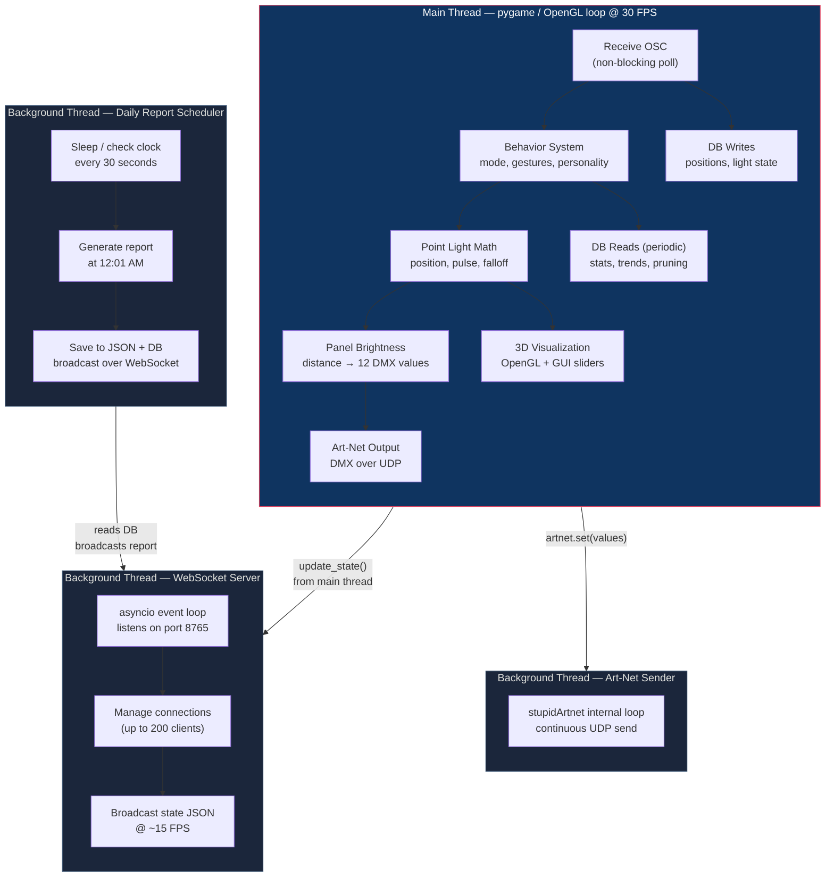
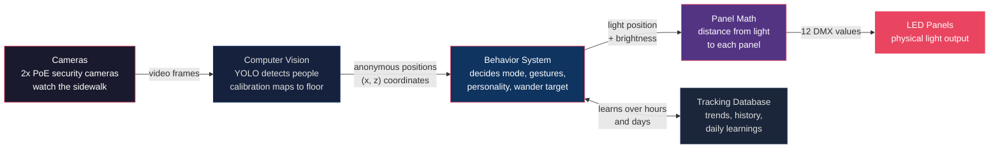

# How Drop Ceiling Works

An accessible overview for curators, artists, visitors, and anyone curious about the installation.

---

## What You See

Four clusters of LED ceiling panels hang in a street-level window. Each cluster is three standard 2 ft × 2 ft office panels joined at angles by 3D-printed connectors. They look like something pulled from a dropped ceiling and reassembled into a sculpture.

A single virtual point of light drifts above the panels. As it moves, the panels closest to it glow brighter and the ones farther away dim — like a flashlight sweeping behind frosted glass. The light pulses slowly, breathing in and out.

When no one is on the sidewalk, the light wanders gently on its own — a slow, meditative drift across the full span of the installation.

When someone stops underneath, the light finds them.

---

## What the Light Does

The light operates in four modes. It chooses which mode to be in based on how many people are nearby and what they're doing.

### Idle

No one is in the zone directly under the panels. The light wanders within a bounding box, picking random target positions and drifting toward them. It pulses slowly and keeps brightness low. Even in idle mode, the light isn't random — it reads data about recent pedestrian traffic and shifts its wander pattern toward the side where people tend to come from.

### Engaged

One or two people have stepped into the active zone. The light immediately turns toward them, brightens, and begins to follow. After a few seconds of standing still, the person and the light enter a kind of shared rhythm. The light starts breathing — its brightness gently oscillating — and occasionally makes small movements: a nod, a lean toward the person, a slow orbit.

The longer someone stays, the deeper the connection. Four progressive phases describe the relationship:

| Phase | Timing | What Happens |
|-------|--------|--------------|
| **Notice** | 0 – 3 seconds | The light turns and fires an entry pulse — "I see you" |
| **Greet** | 3 – 10 seconds | Brightness settles higher, subtle gestures begin (nod, lean) |
| **Engage** | 10 – 30 seconds | The light sways, orbits, breathes more deeply — comfortable in their presence |
| **Bond** | 30 seconds + | Maximum intimacy — very settled, infrequent but warm gestures |

When the person walks away, the light lingers at their last position before slowly returning to its wandering state. The goodbye is deliberately slow.

### Crowd

Three or more people are in the active zone. The light becomes energetic — moving faster, pulsing quicker, shining brighter. It follows the center of the group and may occasionally "bloom," expanding its radius to illuminate all panels at once.

### Flow

Heavy pedestrian traffic is passing through but no one stops. The light drifts with the directional flow of the crowd, as if carried along by the current of people. It positions itself toward the side where new arrivals are coming from.

---

## How It Sees

Two security cameras mounted near the panels watch the sidewalk. The system uses a machine learning model (YOLO) to detect people in the video frames. It doesn't recognize faces or record images. The model outputs bounding boxes — rectangles around each detected person — and discards the video.

Calibration markers on the ground allow the system to translate pixel coordinates from each camera into real-world floor positions (centimeters from the panels). When both cameras see the same person, their detections are merged into a single position. The result is a stream of anonymous (x, z) coordinates at about 15–20 updates per second.

Two zones are defined on the floor:

- **Active zone**: Directly under the panels (~2 meters deep). People here are treated as engaging with the installation.
- **Passive zone**: The wider sidewalk area (~2.7 meters beyond). People here are noticed but not followed — their movement informs trends and flow tracking.

---

## How It Learns

The installation runs 24/7 and adapts over time through three learning systems:

### Auto-Tuning (every 5 seconds)

Six personality sliders define the light's character — how responsive, energetic, social, exploratory, attentive, and memory-driven it is. An auto-tuning system adjusts these sliders every 5 seconds based on recent activity. When the sidewalk is busy, the light becomes more responsive and social. When it's quiet, it explores more widely. A gentle pull toward default values prevents the personality from drifting to extremes.

### Feedback Learning (per engagement)

Every time someone steps into the active zone, the system records a snapshot of what the light was doing: its position, aggression level, whether it was aligned with traffic flow, and the time of day. Over time, the system learns which conditions correlate with engagement and weights those conditions higher. For example, it might learn that center positioning with moderate attention-seeking behavior during lunch hours produces the most engagement.

### Daily Learning (overnight)

At the end of each day, the system computes a summary of what worked at different times of day and blends those learnings into the next day's starting personality. The blend is gentle — 30% influence — so the light evolves gradually rather than lurching between strategies.

---

## How It Outputs Light

The virtual point light has a position, a brightness range, a pulse phase, and a falloff radius. Every frame (~30 times per second), the system calculates the distance from the light to each of the 12 physical panels. Panels within the falloff radius receive brightness proportional to their proximity. Panels outside the radius stay off.

The brightness values are sent to the panels as DMX data over the Art-Net protocol — a standard lighting industry protocol carried over the local network. A DMX decoder receives the values and adjusts the voltage to each panel's dimming circuit.

The result is that the light appears to have a physical presence — it's brightest directly above where it "is" and fades smoothly outward. As it moves, the illumination pattern sweeps across the panels.

---

## Inside the Light Controller

The light controller (`lightController_osc.py`) is one Python process that juggles several jobs at once. It splits the work between a **main loop** that runs 30 times per second and three **background threads** that handle slower tasks without interrupting the animation.

### What runs where

| Component | Where it runs | What it does |
|-----------|---------------|--------------|
| **OSC receive** | Main thread | Polls the UDP socket each frame (non-blocking `select()`). Receives person positions from the camera tracker at ~25 Hz. |
| **Behavior + light math** | Main thread | Decides mode (idle/engaged/crowd/flow), runs gestures, updates the virtual point light, calculates panel brightness. |
| **Art-Net DMX send** | Main thread → background | Main thread calls `artnet.set()` with 12 brightness values; the `stupidArtnet` library sends the UDP packet on its own internal thread. |
| **Database writes** | Main thread | Positions are recorded on each OSC message; light state is logged every 0.5–2 s. Batched commits (every 50 writes or 1 s). |
| **Database reads** | Main thread (periodic) | Stats refresh every 2 s, hourly aggregation at the top of each hour, pruning every hour. All run inline in the main loop during slack time. |
| **WebSocket server** | Daemon thread | Runs its own `asyncio` event loop. The main thread pushes state snapshots into it via `update_state()`; the thread broadcasts JSON to all connected viewers at ~15 FPS. Auto-restarts on failure (up to 50 times). |
| **Daily report** | Daemon thread | Wakes every 30 s to check the clock. At 12:01 AM it pauses tracking, generates a summary report from the database, saves it to disk, broadcasts it over the WebSocket, then resumes tracking. |
| **3D visualization** | Main thread | Pygame/OpenGL renders the panels, light, tracked people, sliders, and HUD. |

All background threads are **daemon threads** — they shut down automatically when the main process exits. The main thread manages graceful shutdown by stopping each subsystem in order: daily scheduler → OSC server → Art-Net → WebSocket → database.

---

## The Big Picture

The entire system is open source and built from consumer hardware: office ceiling panels, PoE security cameras, a standard DMX decoder, and a single Linux computer with a GPU. No proprietary lighting systems, no cloud services, no personal data collection.

---

## Public Viewer

A [real-time 3D viewer](../public-viewer/) shows what the installation is doing right now. It connects to the production machine via a secure WebSocket tunnel and renders the panels, light, and tracked people in your browser. The viewer is hosted on GitHub Pages and works on phones.

Visit [thedropceiling.com](https://thedropceiling.com) to see it live.

---

*For technical details, see the [Behavior System Reference](BEHAVIOR_SYSTEM.md) and [Behavior Diagrams](BEHAVIOR_DIAGRAMS.md).*
