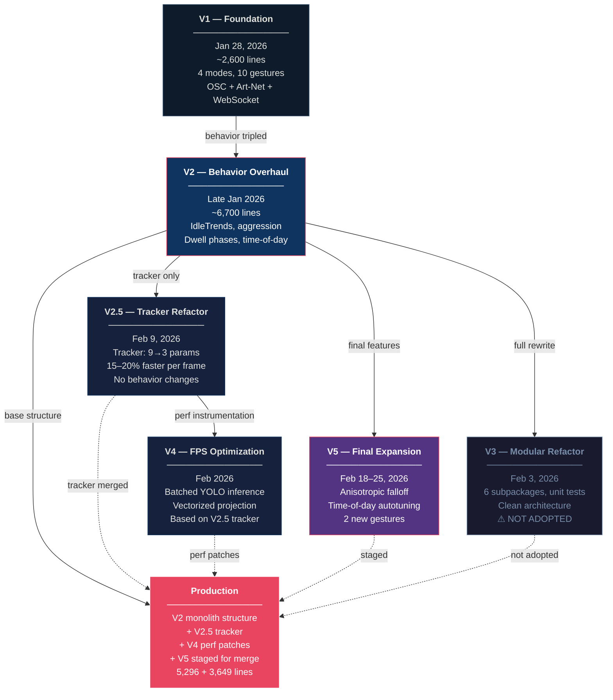
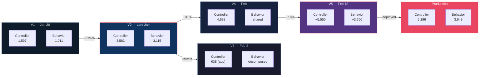
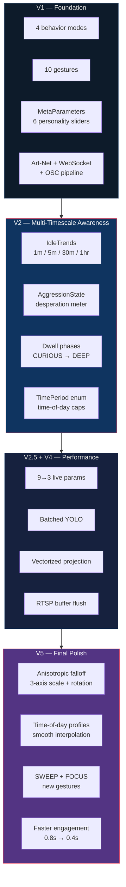

# Version History — All IO Versions

> All diagrams use [Mermaid](https://mermaid.js.org/) syntax and render natively on GitHub.

---

## Version Evolution

How each version relates to the others. V3's modular architecture was designed but not adopted — production continued as the incrementally patched V2 monolith.

---

## Codebase Growth

Line counts for the two core files — light controller and behavior engine — across versions.

---

## Key Innovations per Version

---

## V2 — Behavior Overhaul & Trend System (Late Jan 2026)

**Folder:** `V2Dev/`

Massive behavior expansion — behavior file tripled in size. Added multi-timescale awareness and a desperation/aggression system.

- **IdleTrends**: Multi-timescale trend data (1min, 5min, 30min, 1hr) with activity anticipation, flow momentum, energy level
- **AggressionState**: "Desperation meter" that rises without engagement, falls on conversion. Time-of-day caps (financial district patterns)
- **TimePeriod enum**: LATE_NIGHT, MORNING, AFTERNOON, EVENING — first time-of-day awareness
- **Dwell phases**: CURIOUS (0–3s) → ENGAGED (3–8s) → REWARDED (8–15s) → DEEP (15s+)
- **Zone-based detection in tracker**: `ZoneChecker` class, zone confidence weighting
- **New files**: `world_coordinates.json` as single source of truth, separate calibration, slider settings
- **Design philosophy**: "Convert passersby into engagers" — anticipatory positioning, peripheral pulse, invitation gestures

| File | Lines |
|------|-------|
| lightController_v2.py | 3,582 |
| light_behavior_v2.py | 3,115 |
| camera_tracker_osc_v2.py | 1,292 |
| v2behavior.md | 874 |

---

## V2.5 — Tracker Refactor (Feb 9, 2026)

**Folder:** `V2_5Dev/`

Focused refactor of the camera tracker for speed and simplicity. No behavior changes.

- **Parameters reduced**: 9 → 3 live + 2 config (confidence, fusion distance, smoothing)
- **Zone sorting removed from tracker**: Delegated entirely to lightController (was dead code)
- **`Tracker` class** replaces monolithic `main()` — structured from ~300 lines
- **Performance fixes**: Eliminated double world-coordinate transform, RTSP buffer flushing via `grab()`, reduced GPU→CPU transfers
- **Cyclist merging removed**: Minimal value for sidewalk installation
- **Result**: ~15–20% faster per frame, codebase reduced to ~700 lines target

| File | Lines |
|------|-------|
| camera_tracker_osc.py | 1,009 |
| CODE_REVIEW.md | formal review |
| TUNING_GUIDE.md | 3-slider reference |
| CALIBRATION_REFERENCE.md | coordinate system reference |

---

## V3 — Full Modular Refactor (Feb 3, 2026)

**Folder:** `V3Dev/`

Complete architectural decomposition of the monolith into 6 subpackages. Not adopted for production.

- **Decomposed ~8,000 lines** into: `config/`, `tracking/`, `behavior/`, `visualization/`, `network/`, `display/`
- **New `Application` class** as central coordinator with `AppState` dataclass
- **CLI entry point**: `run.py` with `--headless`, `--test`, `--verbose` flags
- **Unit tests** added: `test_behavior.py`, `test_network.py`, `test_visualization.py`
- **Mock implementations**: `MockDMXOutput`, `MockWebSocketBroadcaster` for testing
- **OSC port changed**: 7000 → 7777
- **BehaviorMode expanded**: IDLE, ACTIVE, FOLLOWING, AMBIENT, PULSE, WAVE
- **Identified issues**: "Parameter zombie" problem from auto-tuning, zone definitions duplicated in 3+ places, over-engineered chart rendering (~1,200 lines of drawing code)

**Note:** This clean architecture was designed but not adopted. Production continued as the incrementally patched monolith.

---

## V4 — Camera Tracker FPS Optimization (Feb 2026)

**Folder:** `V4Dev/` (top-level, not inside IO/)

Performance-focused tracker development based on V2.5 (not V3's modular approach).

- **Stage 1**: Per-stage timing instrumentation with percentile reporting (`--benchmark-interval 60`)
- **Stage 2**: Batched YOLO inference, vectorized projection, reduced GPU→CPU transfers
- **Same OSC contract**: `/tracker/person/<id>`, `/tracker/count`
- Controller (4,698 lines) imports from production `IO/light_behavior.py` and `IO/tracking_database.py`

| File | Lines |
|------|-------|
| camera_tracker_v4.py | 1,207 |
| lightController_osc.py | 4,698 |

---

## V5 — Final Behavior Expansion (Feb 18–25, 2026)

**Folder:** `v5Dev/`

Final major update for the project's last week. Three primary changes based on a week of observation.

1. **Autotuning rework**: Static home values → 6 time-of-day profiles with smooth interpolation. Reduced mean reversion. Removed periodic 6-hour resets.
2. **Faster engaged mode**: IDLE→ENGAGED 0.8s→0.4s, brightness 30→55, entry pulse boost 25→50 with focused beam, re-entry and phase transition pulses.
3. **Anisotropic falloff**: 3-axis falloff scale + Y-axis rotation with spring animation. Two new gestures (SWEEP, FOCUS). Existing gestures enhanced with falloff modifiers. Max intensity raised to 100.

| File | Lines |
|------|-------|
| lightController_osc_v5.py | ~5,550 |
| light_behavior_v5.py | ~3,760 |

---

## Production (Current IO/ root)

The live deployment files. Structurally a V2 monolith with V3/V4 features layered in — **not** the modular V3 architecture.

| File | Lines | Notes |
|------|-------|-------|
| lightController_osc.py | 5,296 | Docstring says "V3" but structure is V2 monolith with patches |
| light_behavior.py | 3,649 | V2 IdleTrends/AggressionState + accumulated patches |
| tracking_database.py | 1,538 | SQLite with zones, flow analysis, velocity tracking |
| camera_tracker_osc.py | — | Production tracker |
| pedestrian_simulator.py | — | Headless testing tool |

---

## Growth Summary

| Version | Date | Controller | Behavior | Key Innovation |
|---------|------|-----------|----------|----------------|
| V1 | Jan 28 | 1,597 | 1,011 | Foundation — 4 modes, 10 gestures, OSC+Art-Net+WebSocket |
| V2 | Late Jan | 3,582 | 3,115 | Multi-timescale trends, aggression, dwell phases |
| V2.5 | Feb 9 | — | — | Tracker refactor: 9→3 params, 15-20% faster |
| V3 | Feb 3 | 638 (app) | decomposed | Full modular refactor (not adopted for production) |
| V4 | Feb | 4,698 | shared | FPS instrumentation, batched YOLO |
| V5 | Feb 18-25 | ~5,550 | ~3,760 | Anisotropic falloff, time-of-day autotuning, new gestures |
| Prod | Current | 5,296 | 3,649 | V2 monolith + V3/V4 patches; V5 staged for merge |
